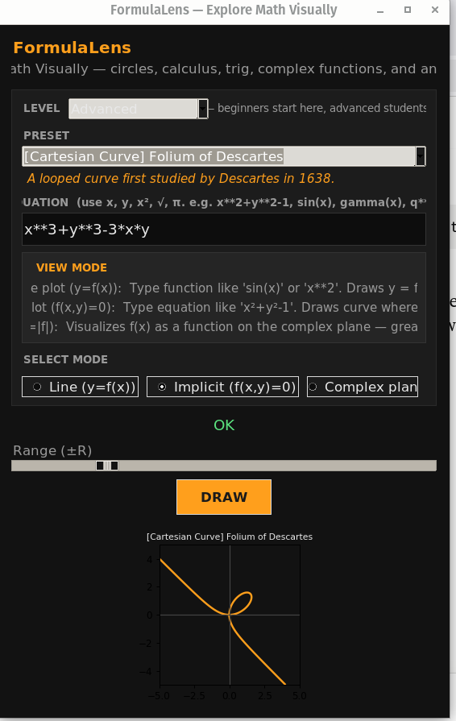
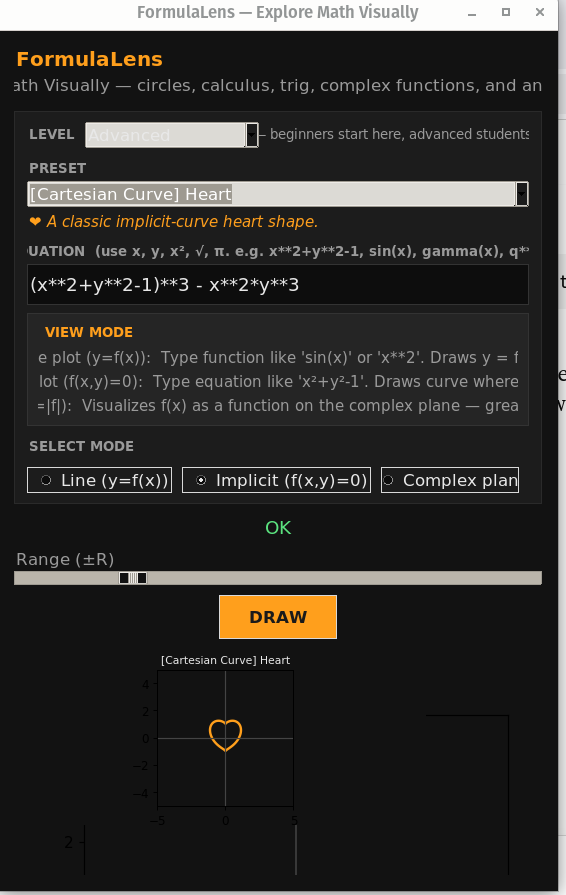
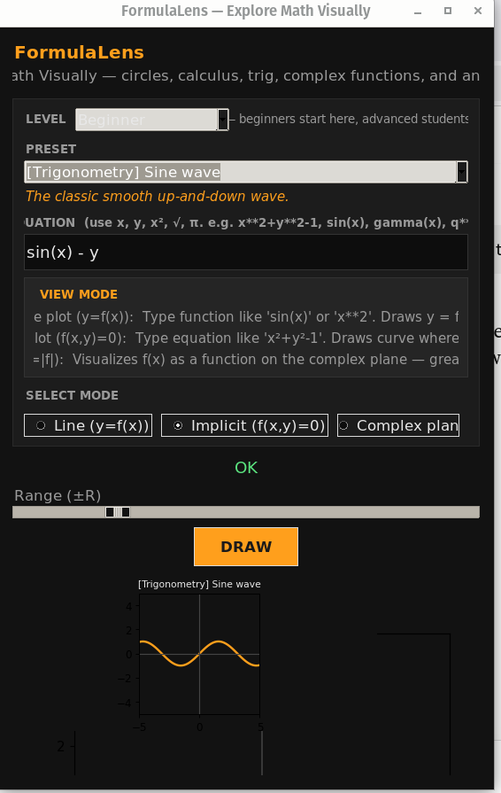

# FormulaLens — Explore Math Visually

A dark-themed desktop **equation viewer** for students — beginners through advanced. Built with **Tkinter** + **Matplotlib**, it renders line plots (`y = f(x)`), implicit curves (`f(x, y) = 0`), and complex-plane domain coloring, with difficulty-tiered presets spanning geometry, trig, calculus, ML, and complex analysis.







## Features

- **Three plotting modes**
  - **Line plot** — `y = f(x)`, e.g. `sin(x)`, `x**2`, `exp(-x**2)`
  - **Implicit plot** — `f(x, y) = 0`, e.g. `x**2 + y**2 - 1` (circle)
  - **Complex domain (domain coloring)** — visualizes `f(x)` as a function on the complex plane, hue = phase, brightness = magnitude — reveals poles, zeros, and singularities that don't show up in a real-valued plot
- **Difficulty-tiered presets** with a **Level filter** (All / Beginner / Intermediate / Advanced) so newcomers aren't overwhelmed and advanced students can dive into richer material:
  - Beginner: circle, ellipse, hyperbola, sine/cosine, parabola
  - Intermediate: cubic, absolute value, sigmoid, Gaussian bell, ReLU, damped wave
  - Advanced — Cartesian curves: heart curve, lemniscate, folium of Descartes
  - Advanced — Complex plane: power function `q⁵`, `sin(10q)`, essential singularity `exp(1/q)`, Jacobi theta function
  - Each preset shows a short **inline description** explaining what it demonstrates
- **Special functions** beyond the basics: `gamma`, `zeta` (Riemann, via Hurwitz), `erf`, `besselj` (Bessel J), `factorial`, and a truncated `theta` (Jacobi theta-3) series
- **Unicode math input** — type `x²`, `√x`, `π`, `×`, `÷` and it's normalized to valid Python expressions automatically
- **Variable aliases** — `q` and `z` are both accepted as synonyms for the plotting variable `x`
- **Summation support** — expressions like `sum(x**(n*n) for n in range(-10, 11))` are evaluated safely
- **Adjustable plot range** via a live slider (±R)
- **Sandboxed evaluation** — equations are parsed and evaluated in a restricted namespace (no access to builtins), safe from arbitrary code execution
- **Dark UI theme** designed for extended use

## Installation

### Requirements
- Python 3.8+
- `numpy`
- `matplotlib`
- `scipy` (optional but recommended — enables `gamma`, `zeta`, `erf`, `besselj`; falls back to a reduced pure-Python set if missing)
- `tkinter` (usually bundled with Python; on Linux you may need to install it separately, e.g. `sudo apt install python3-tk`)

### Setup

```bash
git clone https://github.com/<your-username>/formulalens.git
cd formulalens
pip install -r requirements.txt
python formulalens.py
```

**requirements.txt**
```
numpy
matplotlib
scipy
```

## Usage

1. Launch the app: `python formulalens.py`
2. Optionally pick a **Level** (All / Beginner / Intermediate / Advanced) to filter the preset list
3. Either:
   - Pick a **preset** from the dropdown (this also auto-selects the right view mode and shows a short description), or
   - Type a custom **equation** in the text field
4. Choose a **view mode** if needed:
   - **Line plot (y=f(x))** — for functions of `x` only
   - **Implicit plot (f(x,y)=0)** — for equations involving both `x` and `y`
   - **Complex plane** — domain coloring of `f(x)` treated as a complex function
5. Adjust the **Range (±R)** slider to zoom in/out
6. Click **DRAW** (or press Enter in the equation field) to render

### Equation syntax

| Input                          | Interpreted as         |
|---------------------------------|-------------------------|
| `x**2 + y**2 - 1`               | Circle of radius 1      |
| `x²+y²-1`                       | Same as above (Unicode) |
| `sin(x)`                        | Sine wave                |
| `√(x)` / `sqrt(x)`               | Square root              |
| `π` / `pi`                       | 3.14159...                |
| `1/(1+exp(-x))`                 | Sigmoid                  |
| `sum(x**(n*n) for n in range(-10,11))` | Custom summation series |
| `q**5` / `z**5`                 | Same as `x**5` — `q`/`z` are aliases for the plotting variable |
| `gamma(x)`, `zeta(x)`, `erf(x)`, `besselj(0,x)` | Special functions (require `scipy`) |
| `theta(x)`                      | Truncated Jacobi theta-3 series |

Supported functions: `sin`, `cos`, `tan`, `exp`, `log`, `sqrt`, `abs`, `gamma`, `zeta`, `erf`, `besselj`, `factorial`, `theta`, plus `np.*` for anything else NumPy provides.

### Complex domain coloring

Selecting **Complex plane** mode evaluates your expression over a grid of complex numbers `z = x + iy` and renders the result as an image where:
- **Hue (color)** encodes the *phase* (argument) of `f(z)`
- **Brightness** encodes the *magnitude* `|f(z)|` (log-scaled)

This makes it possible to *see* things a real-valued line plot hides — for example, `exp(1/q)` looks like an unremarkable curve as `y=f(x)`, but in the complex plane it reveals the wild, value-cycling behavior near its essential singularity at the origin (Picard's great theorem).

## How it works

- Equations are first passed through a **Unicode normalizer** that converts superscripts, roots, and math symbols into valid Python syntax.
- The cleaned expression is evaluated in a restricted namespace (`__builtins__` stripped out) using only the functions listed above — this prevents arbitrary code execution from user input.
- Depending on whether `y` appears in the expression, the app either:
  - Evaluates `f(x)` over a 1D grid and plots a line, or
  - Evaluates `f(x, y)` over a 2D meshgrid and draws the zero-contour (`f(x, y) = 0`)

## Project structure

```
formulalens/
├── formulalens.py      # main application
├── requirements.txt
├── outputs/           # created at runtime (currently unused by the UI, reserved for exports)
└── README.md
```

## Roadmap / ideas

- [ ] Export rendered plots to PNG/SVG from the UI
- [ ] Multi-equation overlay (plot several curves at once)
- [ ] Light theme toggle
- [ ] Equation history / favorites
- [ ] Parametric curve support (`x(t), y(t)`)

## Contributing

Issues and pull requests are welcome. If you add a new preset or function, please keep the sandboxed-eval design intact (no raw `eval`/`exec` on unsanitized `__builtins__`).

## License

[MIT](LICENSE) 
